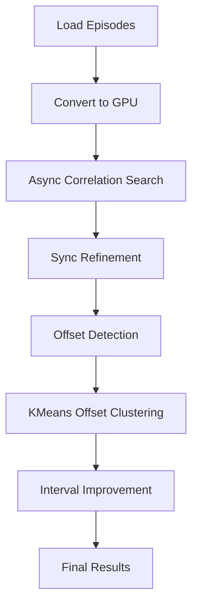

# Algorithm Flow



---

### Steps

1. Load multiple episode audio files.  
2. Convert to GPU arrays via CuPy.  
3. Run asynchronous correlation to find coarse matches.  
4. Run synchronous correlation for refinement.  
5. Detect longest continuous correlated region.  
6. Cluster offsets to find median.  
7. Adjust borders near edges.  
8. Output list of intervals.

---

### Output Format

Example:

```python
[(start=0.25, end=30.25), (start=120.0, end=150.0)]
```
