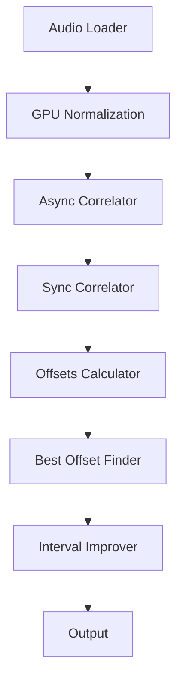

# Architecture

---

### Components

| Module | Function |
|---------|-----------|
| `processors/audio_files.py` | Loads WAV audio files |
| `processors/audio_samples.py` | Handles GPU normalization and correlation orchestration |
| `services/correlator/` | Async and sync correlation computations |
| `services/offsets_calculator.py` | Finds longest correlated region |
| `services/best_offset_finder.py` | Uses KMeans clustering to find dominant offset |
| `services/interval_improver.py` | Adjusts and validates intervals |
