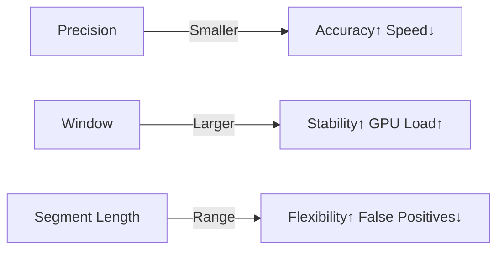

# Configuration

| Parameter | Description | Effect on Accuracy | Effect on Speed |
|------------|-------------|--------------------|-----------------|
| `rate` | Audio sample rate (Hz) | Must match actual file rate | Moderate |
| `min_segment_length_sec` | Minimum intro/outro duration | Detects shorter segments | High cost if too small |
| `max_segment_length_sec` | Maximum intro/outro duration | Filters long false positives | Low |
| `precision_secs` | Time step between correlation frames | Higher precision | Slower |
| `series_window` | Number of episodes compared at once | Improves stability | Exponential GPU cost |
| `offset_searcher_sequential_secs` | Max gap between correlated fragments | Increases tolerance to noise | Moderate |
| `adjustment_threshold` | Enables edge adjustment | Refines output | None |
| `adjustment_threshold_secs` | Sensitivity for trimming | Affects interval borders | Negligible |

---

## Parameter Impact Graph

