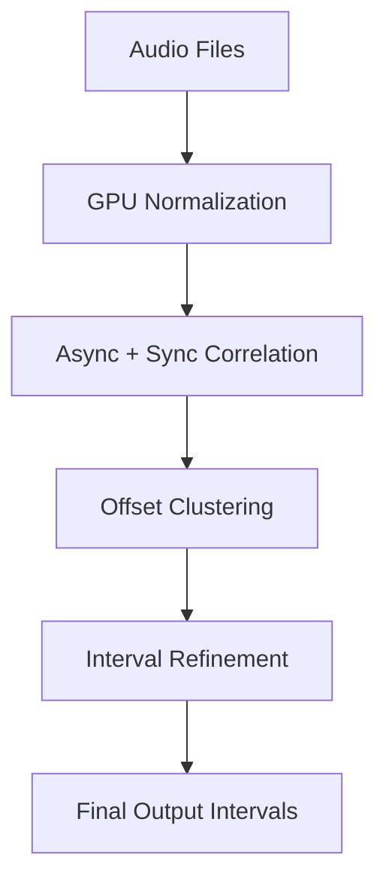

# HRAshton / SeriesIntroRecognizer

`SeriesIntroRecognizer` detects repeated intro/outro segments across a series using GPU-accelerated audio correlation.

---

## 📘 Quick Links

- [[Installation]]
- [[Configuration]]
- [[Architecture]]
- [[AlgorithmFlow]]
- [[GPUProcessing]]
- [[Examples]]
- [[FAQ]]

---

## 🧠 Overview

The system compares episodes pairwise, finds repeating correlated segments, and outputs start–end timestamps marking shared intros or outros.

---

## ⚙️ Key Features

- Full GPU acceleration via CuPy
- Adjustable segment detection parameters
- Works with `.wav` or raw NumPy arrays
- Clustering-based offset estimation
- Configurable precision and correlation windows
